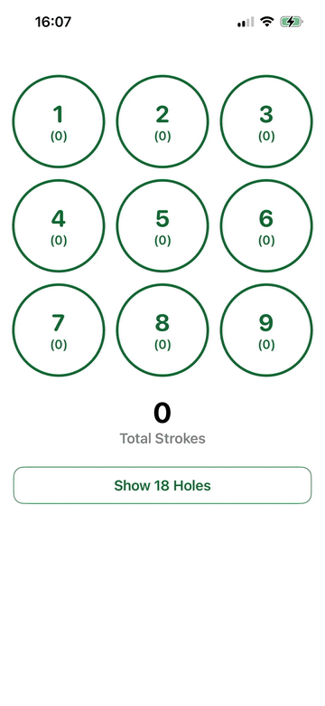

# GolfScore

## Problem

As a beginner golfer, I’m often preoccupied with swing thoughts, club selection, and the occasional lost ball. Keeping track of how many strokes I’ve taken can easily become an afterthought.

I wanted a simple iPhone app that would let me record each stroke as I played, without adding features I didn’t need. Most golf scoring apps I found were crowded with course maps, GPS tracking, club-distance data, multiplayer support, handicap calculations, and other functionality aimed at more experienced golfers.

That’s why I built GolfScore.

GolfScore is a straightforward golf scoring app that lets you record each stroke with a single tap, including directly from the lock screen. There’s no setup, configuration, or unnecessary complexity. Select a hole, tap **+ Stroke**, and repeat.

<p align="center">
  
</p>

## Install On Your iPhone

You need a Mac, an iPhone, and a USB cable to install GolfScore on your iPhone. If you need help, I suggest asking an AI assistant to walk you through it step by step. Just copy and paste this prompt:

```
I want to install an iPhone app from GitHub onto my own iPhone using Xcode. Please guide me one step at a time and wait for me to confirm each step before continuing.

The app is called GolfScore. I need help with:
- installing Xcode
- downloading the GitHub repository (https://github.com/guidolang/golfscore)
- opening `GolfScore.xcodeproj` in Xcode
- selecting my iPhone as the run destination
- setting up Signing & Capabilities with my Apple ID
- changing the bundle identifiers and App Group identifier if necessary
- running the app on my iPhone
- enabling Developer Mode or trusting the developer account if iOS asks

Also explain that without an active Apple Developer Program membership, the app will need to be reinstalled after 7 days.
```

## Development

Build:

```sh
xcodebuild build -project GolfScore.xcodeproj -scheme GolfScore -destination 'platform=iOS Simulator,name=iPhone 17 Pro'
```

Test:

```sh
xcodebuild test -project GolfScore.xcodeproj -scheme GolfScore -destination 'platform=iOS Simulator,name=iPhone 17 Pro'
```

For local device signing, copy `Config/Local.example.xcconfig` to `Config/Local.xcconfig` and replace `YOUR_TEAM_ID` with your Apple Developer Team ID. The local file is ignored by Git.

## Privacy

GolfScore does not collect or transmit personal data. The active round and its stroke timestamps are stored locally on the device.

## Support

For support, bug reports, or feature requests, please open a [GitHub issue](https://github.com/guidolang/golfscore/issues).
